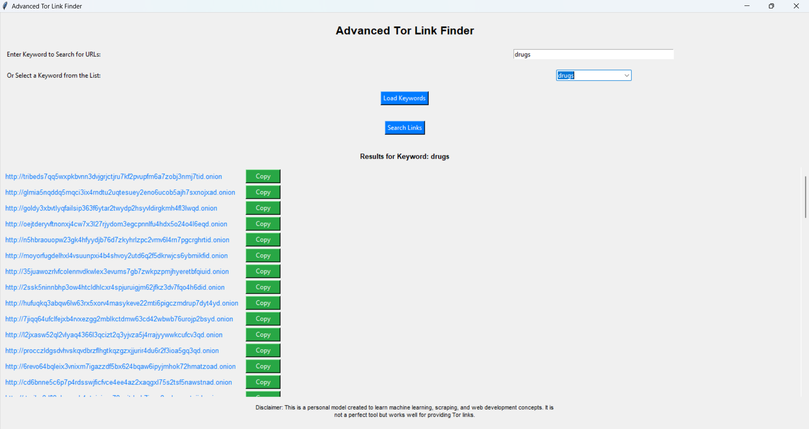

# Advanced Tor Link Finder with Machine Learning
# Contains More than +2500 .onion links
## Overview
The **Advanced Tor Link Finder** is a Python-based application designed to help users efficiently locate and manage .onion URLs associated with specific keywords. By integrating machine learning models, this tool not only retrieves links based on user-input keywords but also predicts relevant keywords when no direct matches are found. The application features a user-friendly GUI built with Tkinter, enhancing accessibility for both technical and non-technical users.

  <!-- Link to your overview image -->
  <!-- Link to your working example image -->

## Features
- **Keyword Search**: Enter a keyword to find related Tor links.
- **Dropdown Selection**: Select keywords from a dropdown menu for quick access.
- **Machine Learning Integration**: Uses a trained model to predict keywords when direct matches are not available.
- **Copy to Clipboard**: Easily copy links to the clipboard for convenient sharing.
- **Disclaimer**: Informative disclaimer regarding the purpose and limitations of the tool.

## Requirements
This project requires the following Python packages:
- `tkinter` 
- `pandas` 
- `pyperclip`
- `pickle`
- `scikit-learn`

You can install the required packages using pip. Create a `requirements.txt` file with the following content:
